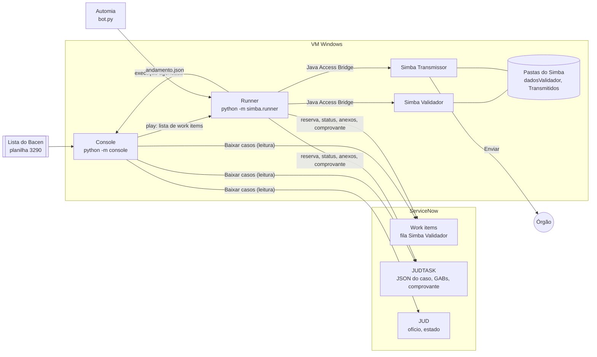
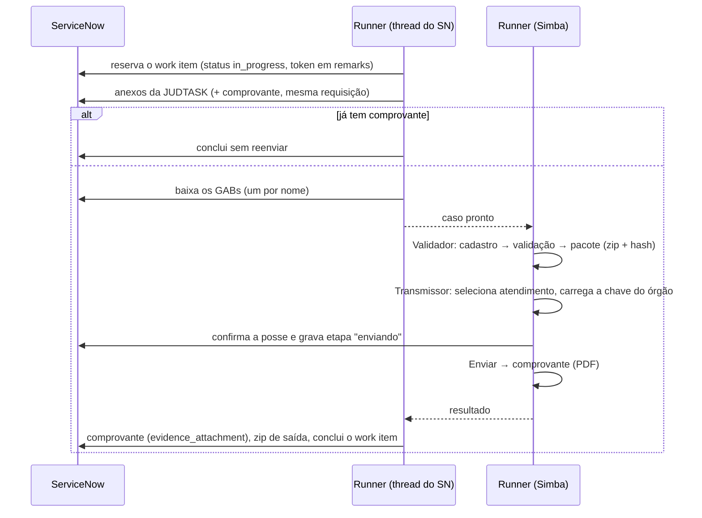

# RPA Simba — Documentação da solução

## 1. Objetivo
Responder as requisições judiciais do CCS enviadas pelo **Simba**: para cada caso, cadastrar o atendimento e validar os arquivos (GAB ou CC 3454) no **Simba Validador**, gerar o pacote, transmitir ao órgão pelo **Simba Transmissor** e registrar o resultado no **ServiceNow**. Um **console** dá a visão executiva, cruza a lista do Bacen com o ServiceNow e dispara as execuções.

A resposta pela **Cabine CCS-JUD** (`cabine_*.py`) é a etapa seguinte e ainda não faz parte do fluxo automático.

## 2. Visão geral

**Princípios**
- **Sem base de dados.** O ServiceNow é a fonte de verdade da execução; a lista do Bacen, do que precisa ser respondido. O console guarda só um retrato (JSON) que muda quando o usuário clica em "Baixar casos".
- **Toda configuração no `.env`** da VM (`simba/config.py`); nada de caminho fixo no código.
- **Nada trava o lote**: erro de um caso vira status no work item + comentário na JUDTASK e o runner segue para o próximo.
- **Nunca reenviar**: depois do Enviar não há nova tentativa automática; comprovante já registrado impede o reenvio.

## 3. Fluxo de um caso

**Esteira.** O gargalo é o limite de requisições do ServiceNow, não o Simba. Enquanto o Simba processa um caso, a thread do ServiceNow reserva/baixa o próximo e registra o anterior (`Runner.processar_lote`). Medido: ~5 casos/min com ~10 requisições por caso (mais um download por GAB).

**Simba.**
- O Validador fica aberto entre os casos (volta ao Passo 1 depois de gerar o pacote) e é reiniciado a cada `VALIDADOR_REINICIO` casos para arquivar os atendimentos acumulados — só dá para mover o `dadosValidador` com ele fechado.
- O Transmissor só lê a lista de atendimentos ao abrir: é fechado antes de cada caso. Programas são fechados por `WM_CLOSE` antes de matar o processo (matar a JVM de um tira o outro do Java Access Bridge).
- Se Validador e Transmissor têm `dadosValidador` diferentes, o atendimento é copiado antes de transmitir (`simba/arquivo.py`).
- Nada no fluxo depende de foco de janela: o runner disparado pelo console roda em segundo plano (a pasta dos GABs é preenchida por `set_text` do Java Access Bridge).

## 4. Componentes

| Módulo | Responsabilidade |
|---|---|
| `bot.py` | entrada do Automia: parâmetros `filas` e `max_itens` |
| `simba/runner.py` | orquestração: reserva, fases do caso, esteira, registro de falhas, CLI (`--lote`, `--lista`, `--simular`) |
| `simba/fila.py` | work items: reserva, etapas sem retorno, heartbeat, reaper, filtro `SIMBA_ITENS_DESDE` |
| `simba/servicenow.py` | cliente REST (Table + Attachment API), limitador de requisições, retry em 429/5xx |
| `simba/fluxo.py` | sequência no Simba: cadastro → validação/geração; transmissão |
| `simba/app.py`, `jab.py`, `screens.py` | controle do processo e das telas (Java Access Bridge), recuperação com reinício |
| `simba/cadastro.py`, `validacao.py`, `geracao.py`, `transmissao.py` | telas do Validador (Passos 1–3) e do Transmissor |
| `simba/correcao.py` | corrige defeitos conhecidos de GABs (UTF-8, BOM, tamanho de linha) e revalida uma vez |
| `simba/chaves.py` | chave `.ASB` e senha por órgão, a partir do CSV de chaves |
| `simba/notificacao.py` | comentários na JUDTASK (por que parou e o que fazer) |
| `simba/arquivo.py` | sincronização e arquivamento do `dadosValidador` |
| `simba/consulta.py`, `lista_bacen.py` | retrato do ServiceNow, leitura da lista do Bacen, cruzamento e exportação |
| `simba/andamento.py` | andamento do lote para o console e pedido de parada |
| `simba/simulacao.py` | modo simulação (lê do ServiceNow real, grava só em memória, nunca envia) |
| `console/app.py` | telas Dashboard, Tarefas e Configuração (NiceGUI) |

## 5. Situações e erros

| Situação no work item | Categoria no console | Exemplos | Quem age |
|---|---|---|---|
| `failure` + `business` | Dados/arquivos | Vara com mais de 10 caracteres; CPF/CNPJ sem relacionamento no período; órgão que só aceita CC 3454 | corrigir a tarefa no ServiceNow e reprocessar |
| `failure` + `application` | Ação manual | chave/senha ausente ou inválida; falha depois do Enviar; 3 tentativas técnicas esgotadas | operador |
| `pending` com mensagem | Técnico (nova tentativa) | Simba travou, ServiceNow instável | o RPA tenta de novo (até 3x, espera crescente) |
| `success` | — | validado, transmitido, comprovante registrado | — |

A mensagem gravada no work item começa pela etapa (`[validando] ...`, `[preparando_envio] ...`), o que permite ao console saber se o caso chegou a ser validado. A JUDTASK recebe um comentário com etapa, erro e orientação.

**Classificação no console** (por requisição do CCS):
- **Validado**: work item com sucesso, já transmitido, ou falha numa etapa depois da validação.
- **Transmitido**: JUDTASK com comprovante (`evidence_attachment`).
- **Cabine**: JUD concluída (estado 3) — o RPA da Cabine conclui a JUD só depois de confirmar.

## 6. Console

| Tela | Conteúdo |
|---|---|
| Dashboard | números do escopo Simba da lista do Bacen (requisições, atendimentos, com/sem work item, validados, transmitidos, Cabine, erros, vencidas sem transmissão), funil, execução em andamento, erros mais frequentes |
| Tarefas | uma linha por requisição do CCS, casada com o work item pelo ofício (`NUM_CTRL_CCS` = `official_letter_number` da JUD); filtros por envio, situação, origem, prazo e erro; seleção e play (com simulação) |
| Configuração | ambiente (.env), situação das chaves por órgão (senha nunca exibida), lista do Bacen |

Antes do play, o console bloqueia lote duplicado (mesmo atendimento), lote já em andamento e Simba ausente, e avisa sobre órgãos sem chave. O runner é disparado como processo separado e segue mesmo se o console fechar. O console escuta só em `127.0.0.1` (não tem login).

Exportação Excel: Resumo, Lista, Erros, Sem work item, Fora da lista.

## 7. Decisões importantes

| Decisão | Motivo |
|---|---|
| Limite de 70 req/min por runner (`SN_REQUISICOES_POR_MINUTO`) | o usuário de integração é bloqueado acima de 100/min |
| Uma execução por VM; paralelismo só com mais VMs | Validador e Transmissor na mesma sessão disputam foco/Java Access Bridge |
| Caso a caso (em esteira), não "valida tudo e depois transmite" | o ganho do lote no Simba (~15%) não compensa: o limite do SN domina, e itens reservados por muito tempo gastam requisições e complicam a recuperação |
| Um zip único com a saída do Validador | cada anexo é uma requisição |
| Conferência de posse só antes do Enviar | economiza requisições e ainda impede transmissão dupla se um segundo runner subir por engano |
| Senhas no CSV de chaves | escolha operacional; o CSV fica numa pasta restrita da VM e nunca é versionado |
| Sem base de dados | exigência: o ServiceNow é a fonte de verdade |

## 8. Testes

| Comando | O que cobre |
|---|---|
| `pytest` | unidade (consulta, chaves, lista, limitador, arquivo, notificação, bot) e telas do Validador com o Simba real |
| `pytest -m cadastro` | fluxo completo com casos fictícios no Simba real, incluindo a esteira com ServiceNow em memória (`tests/sn_falso.py`); nunca clica em Enviar |
| `pytest -m servicenow` | protocolo da fila contra uma fila de teste (`SN_FILA_TESTE`); cria e apaga work items |
| `testar_*.py` | testes manuais contra o ServiceNow real em modo somente leitura (`testar_esteira_servicenow_sem_enviar.py`, `testar_e2e_servicenow_sem_enviar.py`) |

## 9. Limitações conhecidas
- Órgãos que exigem leiaute CC 3454 para corretora não são tratados (falham com mensagem clara).
- Etapa da Cabine CCS-JUD ainda fora do fluxo automático.
- Um teste do fluxo (`test_processa_caso_do_cadastro_ao_pacote_de_envio`) às vezes precisa de uma nova tentativa na primeira validação após reabrir o Simba; em produção a nova tentativa resolve.
- O tempo real do Enviar (upload ao órgão) só será conhecido no primeiro envio de produção.
